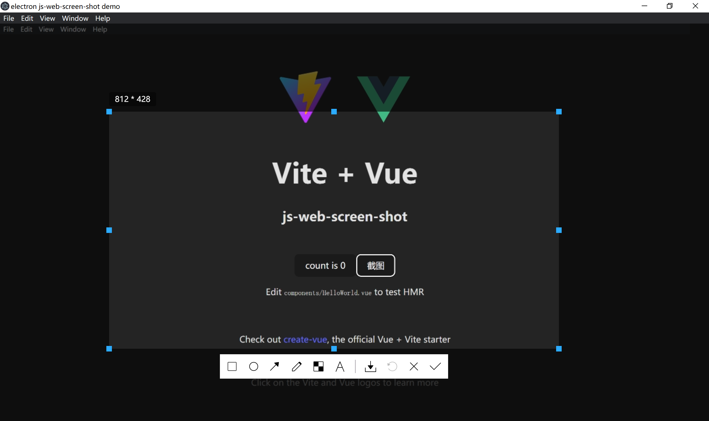

## 截屏效果图



## 依赖

- `vite-plugin-electron` -D
- `vite-plugin-top-level-await` -D
- `electron` -D
- `electron-builder` -D
- `less` -D
- `js-web-screen-shot` -D

## 步骤

1. `vite` 跑通 `electron`
2. `electron` 跑通前后台 `ipc` 通信
3. 定义 `ipc` 事件的枚举类型
4. 定义接入 `ipc` 事件之后，前端(渲染线程)下的`window`挂载了`electron.ipcRenderer`
   - 编写接口定义文件
   - 在 `tsconfig.json` 的 `include` 列表中加入此接口定义文件,以获得 ts 代码提示

---

## electron 环境下使用插件

由于 electron 环境下无法直接调用 webrtc 来获取屏幕流，因此需要调用者自己稍作处理，具体做法如下所示：

- 直接获取设备的窗口，主线程发送一个 IPC 消息 handle

```typescript
// electron主线程
import { desktopCapturer, webContents } from "electron";

// 修复electron18.0.0-beta.5 之后版本的BUG: 无法获取当前程序页面视频流
const selfWindws = async () =>
  await Promise.all(
    webContents
      .getAllWebContents()
      .filter((item) => {
        const win = BrowserWindow.fromWebContents(item);
        return win && win.isVisible();
      })
      .map(async (item) => {
        const win = BrowserWindow.fromWebContents(item);
        const thumbnail = await win?.capturePage();
        // 当程序窗口打开DevTool的时候  也会计入
        return {
          name:
            win?.getTitle() + (item.devToolsWebContents === null ? "" : "-dev"), // 给dev窗口加上后缀
          id: win?.getMediaSourceId(),
          thumbnail,
          display_id: "",
          appIcon: null,
        };
      })
  );

// 获取设备窗口信息
ipcMain.handle("IPC消息名称", async (_event, _args) => {
  return [
    ...(await desktopCapturer.getSources({ types: ["window", "screen"] })),
    ...(await selfWindws()),
  ];
});
```

- 渲染线程(前端)发送消息封装处理(相应写法自己调整)

```typescript
// xxx.ts（`window.electron.ipcRenderer` 的类型定义见本文<步骤>的第4条）
export const getDesktopCapturerSource = async () => {
  return await window.electron.ipcRenderer.invoke<
    Electron.DesktopCapturerSource[]
  >("IPC消息名称", []);
};
```

- 获取指定窗口的媒体流

```typescript
// yyy.ts
export function getInitStream(
  source: { id: string },
  audio?: boolean
): Promise<MediaStream | null> {
  return new Promise((resolve, _reject) => {
    // 获取指定窗口的媒体流
    // 此处遵循的是webRTC的接口类型  暂时TS类型没有支持  只能断言成any
    (navigator.mediaDevices as any)
      .getUserMedia({
        audio: audio
          ? {
              mandatory: {
                chromeMediaSource: "desktop",
              },
            }
          : false,
        video: {
          mandatory: {
            chromeMediaSource: "desktop",
            chromeMediaSourceId: source.id,
          },
        },
      })
      .then((stream: MediaStream) => {
        resolve(stream);
      })
      .catch((error: any) => {
        console.log(error);
        resolve(null);
      });
  });
}
```

- 前端调用设备窗口信息

```typescript
import { getDesktopCapturerSource } from "xxx.ts";
import { getInitStream } from "yyy.ts";
import ScreenShot from "js-web-screen-shot";

export const doScreenShot = async () => {
  // 下面这两块自己考虑
  const sources = await getDesktopCapturerSource(); // 这里返回的是设备上的所有窗口信息
  // 这里可以对`sources`数组下面name进行判断，更具你当前窗口的标题名称找到当前的electron窗口
  const stream = await getInitStream(
    sources.filter((e) => e.name == "你当前窗口的标题名称")[0]
  );

  new ScreenShot({
    enableWebRtc: true, // 启用webrtc
    screenFlow: stream!, // 传入屏幕流数据
    level: 999,
  });
};
```
